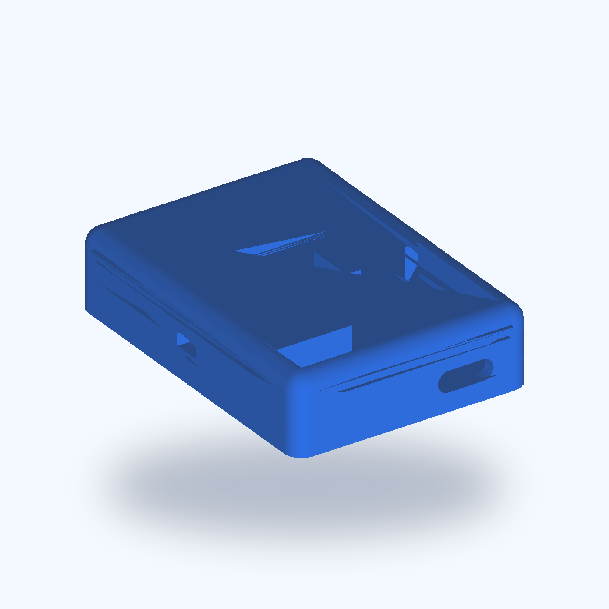
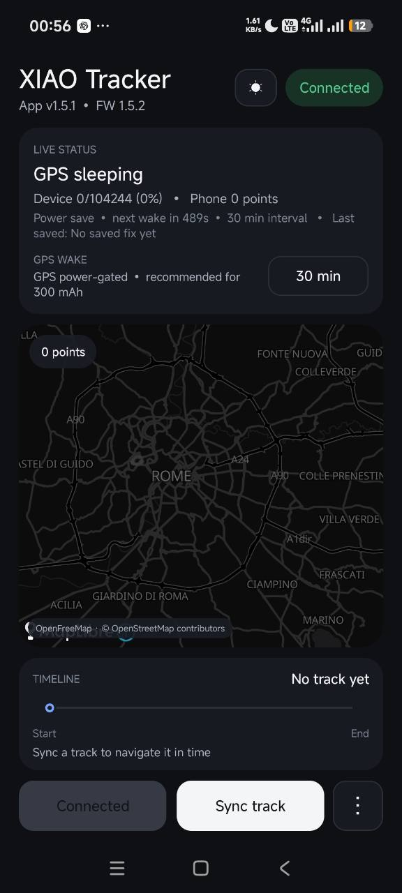

# XIAO GPS Tracker

**A compact, private, low-cost GPS tracker built from accessible maker hardware.**

Log a route without a SIM card, subscription, or cloud account. The tracker stores positions locally, then sends them over Bluetooth to an Android phone whenever you want to view or export the journey.



The project combines a Seeed Studio XIAO nRF52840, an inexpensive GPS receiver, a small LiPo battery, a native Android companion app, and a printable enclosure.

## Why this tracker?

- **No monthly fee** — no SIM card and no data plan.
- **Private by design** — tracks stay on the device and your phone.
- **Battery-conscious** — the GPS can be completely switched off between fixes.
- **Configurable** — choose a point every 1, 15, or 30 minutes, or every 1, 2, or 3 hours.
- **Large offline history** — more than 104,000 positions fit in the onboard circular log.
- **Easy phone sync** — connect only when needed; logging continues without the phone.
- **Useful exports** — save a journey as GPX or CSV.
- **Open maps** — the app uses MapLibre and OpenFreeMap, with light and dark themes.
- **Pocket-size hardware** — an enclosure is included as STL, 3MF, and Fusion 360 source.

## Built for longer battery life

The reference build uses a small **300 mAh LiPo**. Battery use changes dramatically with the selected recording interval:

- At **1 minute**, the GPS stays powered after it gets a fix. This gives the most detailed route and uses the most energy.
- At **15 minutes or longer**, the tracker removes power from the GPS between points and wakes it shortly before the next point is due.
- BLE advertises slowly, and the Android app disconnects automatically after inactivity.
- The onboard flash enters deep power-down when it is not being used.

In practice, this design can move a tiny battery from an hours-oriented high-detail profile toward **days or potentially weeks at longer intervals**. Actual runtime depends on satellite visibility, time-to-fix, the GPS board, battery health, temperature, and especially the boost converter's shutdown current. No fixed runtime is claimed until the exact hardware build has been bench-tested.

## What you need

AliExpress changes listings and sellers frequently, so these are non-affiliate search links rather than endorsements of a particular shop.

| Component | What to look for | AliExpress |
| --- | --- | --- |
| Seeed Studio XIAO nRF52840 | The standard nRF52840 board; Sense is not required | [Search](https://www.aliexpress.com/w/wholesale-xiao-nrf52840.html) |
| ATGM336H-compatible GPS breakout | A 5 V board exposing `5V`, `RX`, `TX`, `GND`, and optionally `PPS` | [Search](https://www.aliexpress.com/w/wholesale-atgm336h-gps-module.html) |
| 300 mAh 1S LiPo | 3.7 V protected cell that physically fits the enclosure | [Search](https://www.aliexpress.com/w/wholesale-300mah-3.7v-lipo-battery.html) |
| 3.7 V to 5 V boost converter | Must have an enable pin and low shutdown/quiescent current | [Search](https://www.aliexpress.com/w/wholesale-3.7v-to-5v-boost-enable.html) |
| Small slide switch | Optional physical master power switch | [Search](https://www.aliexpress.com/w/wholesale-mini-slide-switch.html) |

> [!IMPORTANT]
> Check dimensions, pin labels, logic levels, polarity, and LiPo connector wiring before ordering. Similar-looking marketplace modules are not always electrically equivalent.

## How it works

1. The GPS receiver obtains a position and the XIAO saves it to onboard flash.
2. The tracker sleeps or power-gates the GPS until the next configured interval.
3. The Android app connects over bonded BLE to sync, browse, and export the route.

The first bonded phone becomes the owner. A hardware recovery procedure can change the owner without erasing the route history.

## Android companion app

The native Android app shows tracker status, battery-saving mode, the selected wake interval, an interactive map, and a time-based route timeline. It can sync the local log over BLE and export tracks as GPX or CSV without sending them to a cloud service.

<p align="center">
  
</p>

## Included in this repository

```text
firmware/   Arduino firmware, setup notes, and detailed wiring
android/    Native Android companion app
enclosure/  STL, 3MF, Fusion 360 source, render, and render script
docs/       README images and project media
```

### Start here

- [Firmware setup and technical details](firmware/README.md)
- [300 mAh LiPo wiring guide](firmware/WIRING_300MAH.md)
- [Android project](android/XiaoGpsTrackerApp)
- [Printable enclosure](enclosure/Seeed_GPS_Tracker.stl)
- [Release notes](RELEASE_NOTES.md)

For the firmware, use the non-mbed **Seeed nRF52 Boards** Arduino core and change the example BLE pairing PIN before flashing. The Android project targets JDK 17.

## Future development

The current BLE tracker is the foundation for several planned variants built around the same compact, local-first platform. These ideas are a roadmap and are **not implemented in the current release**.

### RF version

- Add a **LoRa radio** for long-range, low-power position and status communication beyond normal Bluetooth range.
- Explore **Meshtastic integration** so compatible nodes can relay tracker data through an off-grid LoRa mesh.
- Retain local flash logging when a radio link or gateway is unavailable.

### SIM version

- Integrate a **SIM800L GSM/GPRS module** for remote position updates where compatible 2G service is still available.
- Add store-and-forward behavior so the tracker can upload queued positions after coverage returns.
- Redesign the power stage for the SIM800L's transmission-current peaks.

> [!NOTE]
> SIM800L depends on 2G service, which has already been retired in some countries and networks. Regional network compatibility must be checked before developing or buying parts for this variant.

### Long-autonomy version

- Replace the small pouch cell with a protected, quality **18650 Li-ion cell** for substantially more stored energy.
- Develop a larger enclosure with safe cell retention and service access.
- Profile every always-on load and tune the GPS, BLE, LoRa, or Meshtastic duty cycle for extended unattended operation.

Future autonomy targets will be published only after complete hardware builds have been measured under representative conditions.

## Storage capacity

The tracker holds 104,244 GPS points before its circular log overwrites the oldest entries. That is approximately:

| Interval | On-device history |
| --- | ---: |
| 1 minute | 72 days |
| 15 minutes | 3.0 years |
| 30 minutes | 5.9 years |
| 1 hour | 11.9 years |
| 2 hours | 23.8 years |
| 3 hours | 35.7 years |

Points already synced to Android remain in the phone archive even after the tracker eventually overwrites its oldest records.

## Project status

The Android app builds successfully in the current workspace. Firmware behavior and the battery strategy are implemented, but battery-duration figures still require measurement on the exact GPS, boost converter, battery, and enclosure assembly used for a build.

This is a personal/offline logger, not a live anti-theft or emergency tracker: it has no cellular connection and does not continuously report its location to a remote service.

## License

See [LICENSE](LICENSE).
